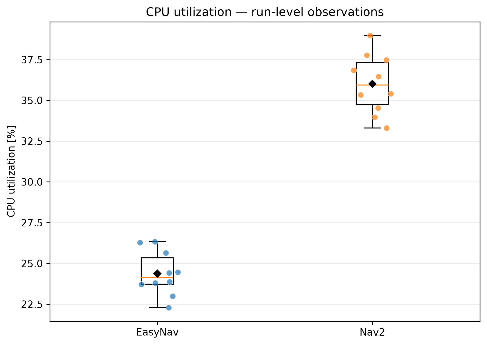
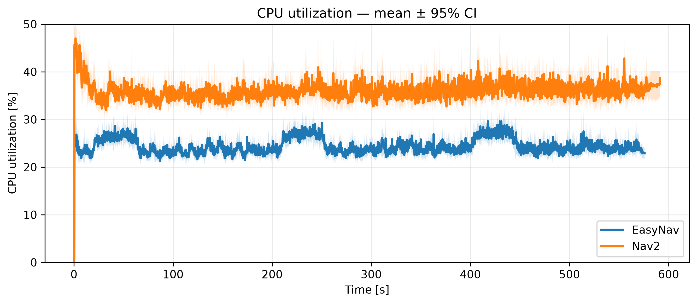
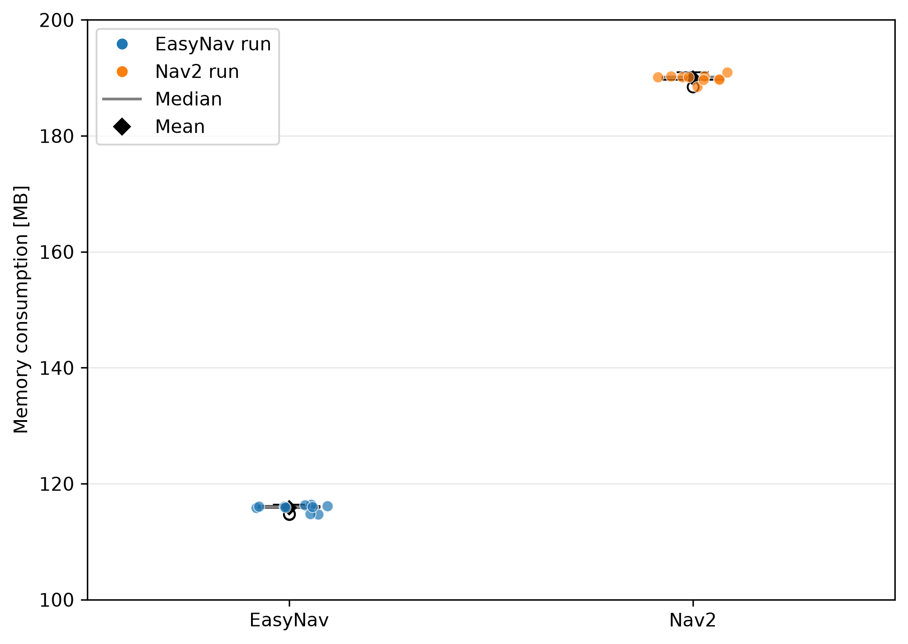
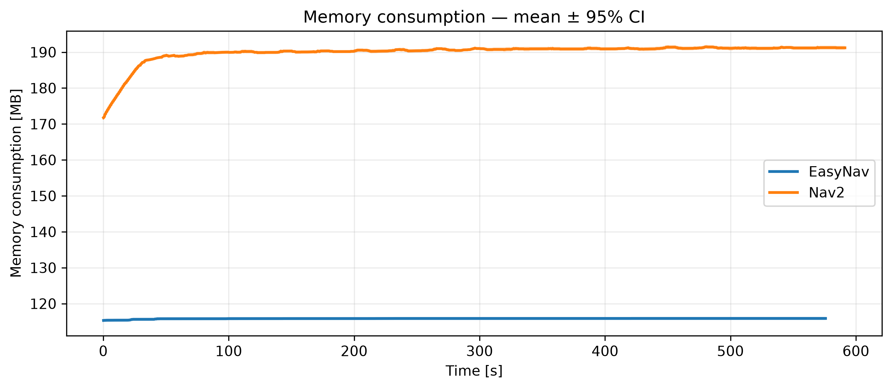
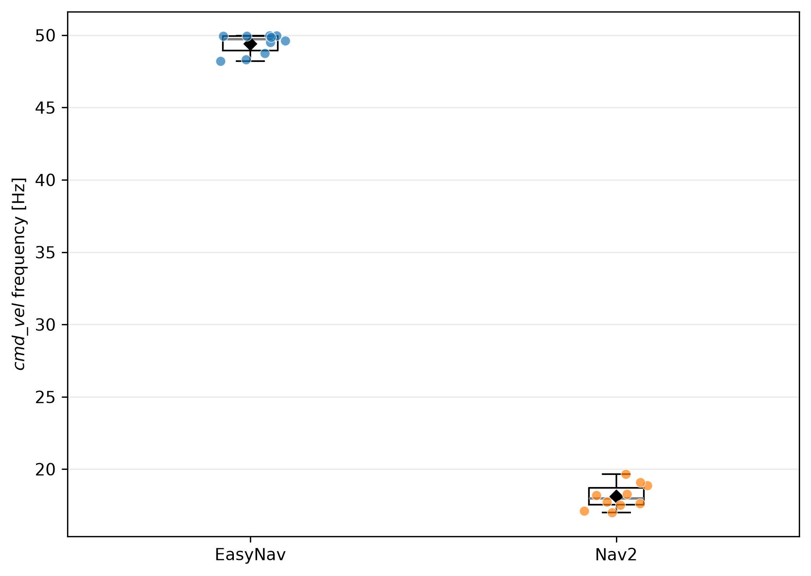
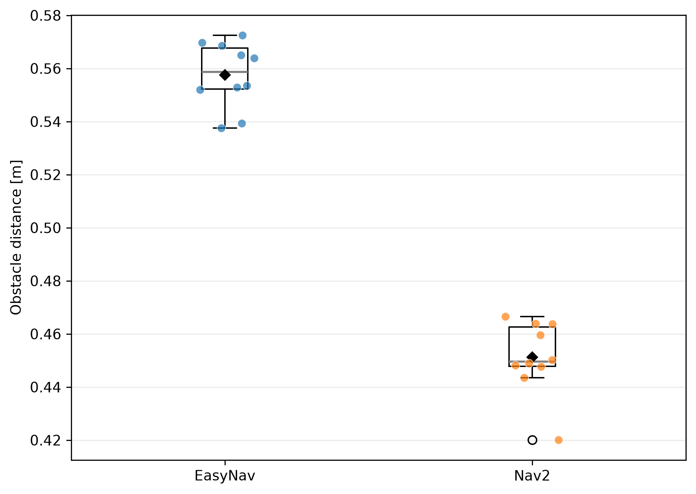
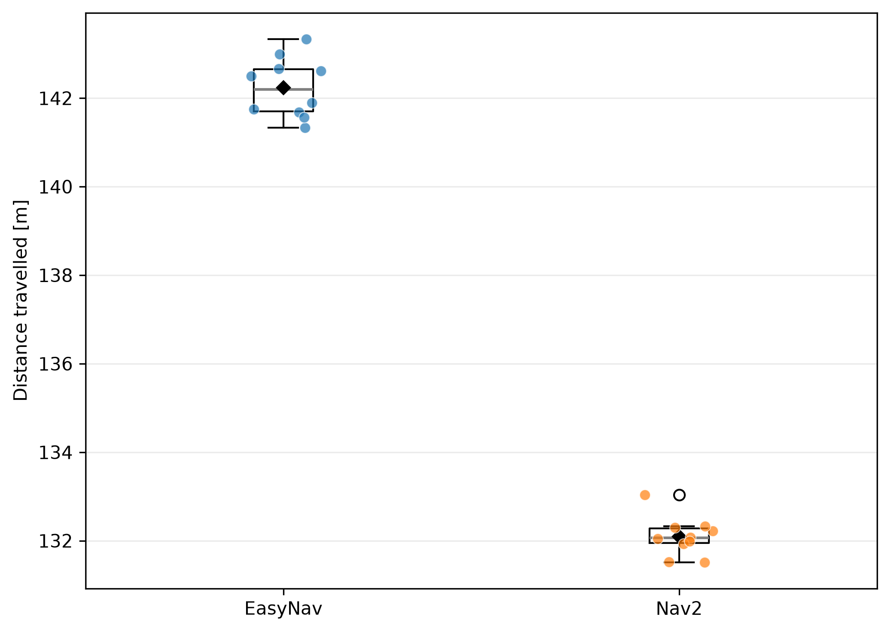
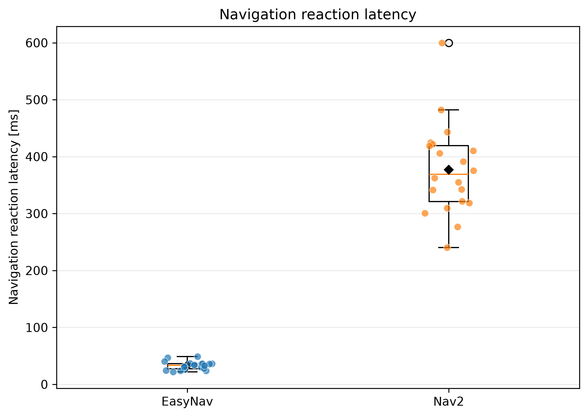

# Experimental Evaluation of EasyNav

This repository contains the experimental evaluation used to compare *EasyNav* and *Nav2* navigation architectures on a real iCreate Turtlebot 4 robot.

The evaluation focuses on computational resource consumption during autonomous navigation and reaction latency to a controlled navigation-blocking event. The objective is not to determine which system provides better navigation performance, but to characterize their computational requirements and reaction to a controlled blocking event under the evaluated experimental conditions.

The research questions are:

- RQ1: Computational efficiency - *Does EasyNav require fewer computational resources than Nav2 during autonomous navigation?*
- RQ2: Reaction latency - *Does EasyNav exhibit lower navigation reaction latency than Nav2 when a controlled navigation-blocking event is introduced?*

## Setup

The experiments compare EasyNav 0.4.0 and Nav2 1.3.12 on ROS 2 Jazzy using `rmw_fastrtps_cpp`, running on the same Raspberry Pi hardware onboard on the Turtlebot 4.

Nav2 is deployed as a composed set of nodes with intra-process communication enabled, providing an execution model close to the component-based EasyNav architecture.

The purpose is to compare the two navigation stacks under a common configuration rather than to optimize either stack independently. The reported resource-consumption results therefore characterize the evaluated EasyNav and Nav2 configurations under the experimental conditions described here. The Nav2 configuration is based on the [TurtleBot4 Jazzy navigation configuration](https://github.com/turtlebot/turtlebot4/tree/jazzy/turtlebot4_navigation/config). Parameters were adapted where necessary to obtain comparable navigation conditions between the two stacks. These changes were defined before the experiments and kept fixed throughout all runs.

### Controller

Both systems use Regulated Pure Pursuit (RPP) as the local controller. The controller runs at 20 Hz in both systems. The main RPP parameters are also matched, including the desired linear velocity (`0.35 m/s`), acceleration and deceleration limits, lookahead parameters, and rotate-to-heading settings.

The MPPI controller used in the reference TurtleBot4 configuration was replaced by RPP in Nav2 to match the controller used by EasyNav and avoid the additional computational cost of MPPI on the Raspberry Pi.

### Localization

Both systems use AMCL-based localization. The maximum number of particles is set to 3000 in Nav2, matching the fixed particle count used by EasyNav and the maximum value in the TurtleBot4 configuration. Nav2 retains adaptive particle sampling between 1000 and 3000 particles, while EasyNav uses a fixed number of particles. The increase in the particle count was required to obtain reliable localization in the narrow corridors used in the experiments.

EasyNav's motion-model noise parameters were selected within the same range as those used by the Nav2 AMCL configuration. Since the two implementations expose different motion-model parameters, exact numerical equivalence is not assumed.

### Costmap

Both systems use the same map and LiDAR data from `/scan`. The `cost_scaling_factor` is set to 3.5 in both configurations, following the TurtleBot4 reference configuration.

The robot footprint is defined according to the physical robot geometry. The corresponding inflation parameters are therefore based on the robot dimensions rather than tuned from the experimental results.

EasyNav uses a unified costmap manager, whereas Nav2 separates local and global costmaps. Consequently, parameters are matched according to their function where a direct correspondence exists.

### Planner

Both systems use grid-based global planning over the same map. Nav2 uses `NavFn`, while EasyNav uses `CostmapPlanner`. EasyNav replanning is configured at 0.5 Hz. Since the planners are different implementations, the comparison does not assume identical computational cost.

### Lifecycle heartbeat

Nav2 uses a `bond_heartbeat_period` of 0.5 s, instead of the 0.1 s value used in the reference configuration. This value was selected based on measurements reported in the [Nav2 issue discussion](https://github.com/ros-navigation/navigation2/issues/5784#issuecomment-3663491309), which showed a substantial reduction in CPU utilization as the heartbeat period was increased. A value of 0.5 s provided most of the observed reduction while maintaining a shorter response interval.

This parameter only affects lifecycle supervision and does not modify the navigation algorithms. EasyNav does not implement an equivalent lifecycle heartbeat mechanism.

### Latency-specific configuration

Experiment 2, latency experiment, uses the same navigation configuration as the setup experiment; only the two parameters described below are modified.

EasyNav's localization update frequency is set to 2 Hz as its localization updates periodically according to `freq`, whereas Nav2 AMCL is event-driven and updates the particle filter according to the configured motion thresholds. Since the two mechanisms do not have a direct one-to-one frequency correspondence, the 2 Hz setting was selected based on the effective update frequency measured for Nav2 under the experimental conditions.

For Nav2, `bond_heartbeat_period` is increased from 0.5 s to 0.65 s. This provides a conservative margin to reduce the CPU overhead associated with lifecycle supervision during the additional processing required by the controlled blocking experiment.

---

## Experiment 1: Navigation Performance

The first experiment evaluates the behaviour of the complete navigation stack during autonomous navigation on the real robot. Its purpose is to characterize differences in computational requirements between EasyNav and Nav2 under real-world sensing and actuation conditions.

The task consists of a patrolling mission in which the robot completes 3 laps through 5 predefined waypoints. Each execution lasts approximately 9 minutes and covers around 130 m. Ten independent executions are performed for each framework.

During each run, the benchmark evaluator periodically samples the running navigation process and records measurements in CSV files under:

```text
results/cycle/
```

The experiment measures:

- CPU utilization;
- memory consumption;
- velocity-command publication frequency;
- distance to the closest detected obstacle;
- accumulated distance travelled.

To reproduce the experiment:

```bash
ros2 launch easynav_experiments easynav_experiment.launch.py run_id:=1
```

or:

```bash
ros2 launch easynav_experiments nav2_experiment.launch.py run_id:=1
```

### Experimental procedure

The benchmark evaluator samples the monitored process every 50 ms. At each sampling step, the current timestamp, CPU utilization, memory consumption, obstacle distance, `cmd_vel` frequency, and accumulated travelled distance are recorded.

All measurements are performed on the Raspberry Pi 4 onboard the robot, with the complete navigation stack running on the same platform. The Raspberry Pi is configured in performance mode to minimize variations caused by dynamic CPU frequency scaling.

| Metric | Description | Measurement |
| --- | --- | --- |
| `cpu` | CPU utilization of the monitored navigation process | Computed from the change in process user + system CPU time between consecutive samples, normalized by elapsed wall-clock time |
| `memory` | Resident memory consumption of the monitored navigation process | Read from `VmRSS` in `/proc/<pid>/status` and converted from kB to MB |
| `obstacle_distance` | Distance to the closest detected obstacle | Minimum valid LiDAR range in each scan |
| `cmd_vel_frequency` | Velocity-command publication frequency | Estimated from recent `cmd_vel` timestamps using a sliding window of up to 50 messages |
| `distance_travelled` | Accumulated travelled distance | Sum of Euclidean displacement between consecutive odometry positions |
| `time` | Relative experiment timestamp | Elapsed time in seconds since the beginning of the measurement |

The complete run-level data and statistical analysis are generated by:

```bash
python3 scripts/analyze_experiment1.py
```

Results are stored under:

```text
results/cycle/analysis/
```

### Results

Ten independent executions were performed for each architecture. The complete navigation run is considered the experimental unit; temporal measurements are first summarized within each execution, and the resulting run-level observations are used for the statistical comparison. This avoids treating temporally correlated samples from the same execution as independent observations.

The results show substantial and highly consistent differences between EasyNav and Nav2, particularly in computational resource consumption.

#### RQ1: Computational efficiency

*Does EasyNav require fewer computational resources than Nav2 during autonomous navigation?*

| Metric | EasyNav | Nav2 | Mean difference | 95% CI | Holm-adjusted Welch p-value | Cohen's *d* |
| --- | ---: | ---: | ---: | ---: | ---: | ---: |
| CPU utilization | 97.51% | 144.03% | −46.52 pp | [−52.55, −40.49] pp | < 0.001 | −7.29 |
| Memory consumption | 115.83 MB | 189.96 MB | −74.13 MB | [−74.71, −73.54] MB | < 0.001 | −118.79 |

EasyNav uses **32.3% less CPU** and **39.0% less memory** than Nav2 on average. The 95% confidence intervals (CI) are relatively narrow, indicating precise estimates of the mean differences, particularly for memory consumption. Welch's test yields $p < 0.001$ for both comparisons, providing strong evidence that the observed differences in mean resource consumption are unlikely to be due to run-to-run variability alone. After Holm correction for the two primary comparisons, both differences remain statistically significant. Cohen's $d$ indicates that the observed differences are large relative to the variability across the 10 executions.

##### Computational resource profiles

Distribution plots show run-level observations, while temporal profiles show the mean ± 95% confidence interval throughout the mission.

**CPU utilization**





**Memory consumption**





#### Additional execution metrics

Additional execution metrics are reported to characterize differences in command publication and trajectory behaviour during the navigation task.

| Metric | EasyNav | Nav2 | Mean Difference | 95% CI | Welch p-value |
| --- | ---: | ---: | ---: | ---: | ---: |
| `cmd_vel` frequency [Hz] | 49.41 | 18.11 | +31.30 Hz | [30.55, 32.05] | < 0.001 |
| Obstacle distance [m] | 0.558 | 0.451 | +0.106 m | [0.094, 0.119] | < 0.001 |
| Distance travelled [m] | 142.23 | 132.09 | +10.14 m | [9.60, 10.68] | < 0.001 |

##### `cmd_vel` publication frequency

EasyNav publishes velocity commands at approximately **49.4 Hz**, compared with **18.1 Hz** for Nav2. In EasyNav, `cmd_vel` publication is driven by the framework's 50 Hz real-time execution cycle, rather than the controller's configured 20 Hz update frequency. Therefore, the measured 49.4 Hz reflects the framework execution rate, not the controller update frequency.



##### Obstacle distance

EasyNav exhibits a mean minimum LiDAR distance of approximately **0.558 m**, compared with **0.451 m** for Nav2. This difference reflects the trajectories produced by the respective navigation systems under the configured parameters rather than a direct measure of safety. No collisions were observed in any of the 20 executions.



##### Distance travelled

EasyNav accumulates approximately **142.2 m** per execution, compared with **132.1 m** for Nav2. The approximately **10.1 m difference** indicates that the two systems produce different execution trajectories during the same waypoint-based patrol. This metric is therefore used to characterize runtime behaviour rather than navigation quality.



---

## Experiment 2: Navigation Reaction Latency

The second experiment evaluates the reaction latency of EasyNav and Nav2 to a controlled navigation-blocking event.

A `scan_mode_bridge` node is placed between the LiDAR and the navigation stack. During normal operation, it forwards the LiDAR measurements unchanged. At a predefined point during navigation, it switches to `BLOCKED` mode and replaces the LiDAR ranges with a fixed blocked value. This provides the same controlled trigger for both frameworks. Twenty independent executions are performed for each framework.

The experiment uses two components:

1. Robot side: the navigation stack and `scan_mode_bridge` run on the Raspberry Pi 4 onboard the robot.
2. Host side: the experiment script sends the navigation goal, triggers the blocking event, monitors the stop condition, restores normal LiDAR operation, and returns the robot to its initial position.

For each execution, the robot navigates towards a predefined goal for a fixed period before the blocking event is triggered. The reaction latency is measured as:

$$
T_{latency} = T_{stop} - T_{trigger}
$$

where $T_{trigger}$ is the timestamp at which `scan_mode_bridge` receives the first blocked LiDAR scan, and $T_{stop}$ is the timestamp of the first `cmd_vel` message satisfying the configured stopping thresholds. Both timestamps are measured using the same steady clock on the Raspberry Pi.

### Running the experiment

On the Raspberry Pi 4, launch the corresponding navigation stack together with the `scan_mode_bridge`.

For EasyNav:

```bash
ros2 launch easynav_experiments easynav_latency.launch.py
```

For Nav2:

```bash
ros2 launch easynav_experiments nav2_latency.launch.py
```

The host PC then runs the corresponding experiment script:

```bash
./scripts/easynav_latency.sh
```

or:

```bash
./scripts/nav2_latency.sh
```

The resulting latency measurements are stored under:

```text
results/latency/
```

Each file contains one latency measurement per execution. The statistical analysis and plots are generated by:

```bash
python3 scripts/analyze_experiment2.py
```

Results are stored under:

```text
results/latency/analysis/
```

### Results

Twenty independent executions were performed for each architecture. Each execution provides one latency observation and is treated as the experimental unit. Welch's t-test is applied to the resulting run-level values.

#### RQ2: Reaction latency

*Does EasyNav exhibit lower navigation reaction latency than Nav2 when a navigation-blocking event is introduced during autonomous navigation?*

| Metric | EasyNav | Nav2 | Mean difference | 95% CI | Welch p-value | Cohen's *d* |
|---|---:|---:|---:|---:|---:|---:|
| Navigation reaction latency | 32.97 ms | 377.19 ms | −344.21 ms | [−381.84, −306.58] ms | < 0.001 | −6.05 |

EasyNav achieves a **91.3% lower mean navigation reaction latency** than Nav2, corresponding to an average reduction of **344.21 ms**. The 95% confidence interval (CI) is relatively narrow, indicating a precise estimate of the mean difference. Welch's test yields $p < 0.001$, providing strong evidence that the observed difference in mean reaction latency is unlikely to be due to run-to-run variability alone. Cohen's $d$ indicates that the observed difference is large relative to the variability across the 20 executions.


